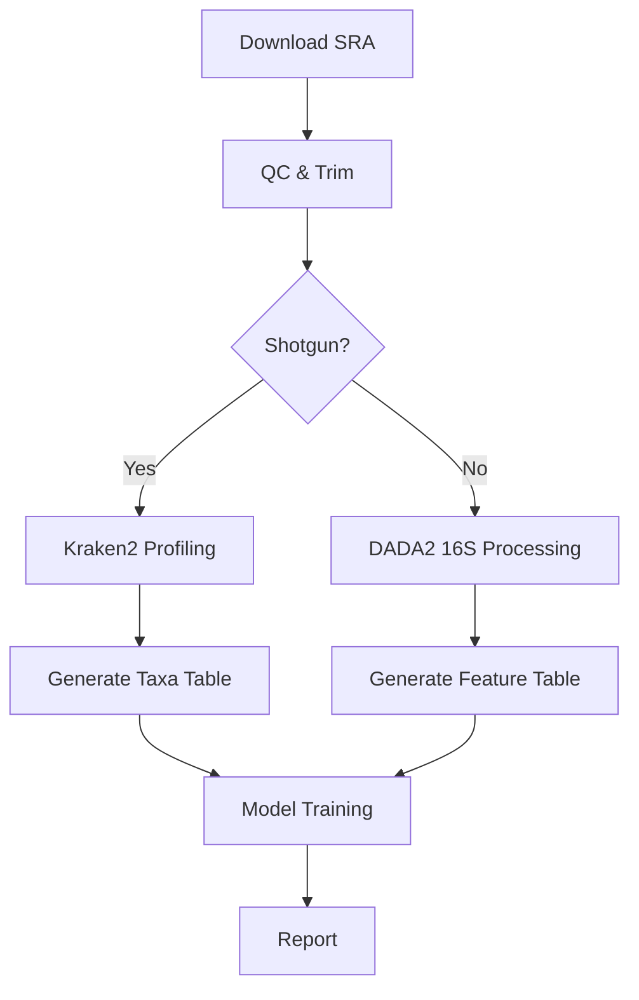

# Team2_AI_Microbiome_Poultry

A collaborative BioAI Hackathon project applying machine learning to poultry microbiome data for predictive health and production trait modeling.

---

## 📌 Team
- Mxolisi Nene (Team Lead)  
- Karthikeyan Govindan  
- Rajarshi Mondal  

---

## 🎯 Goal
Use publicly available poultry microbiome datasets (16S rRNA / Metagenomics) to identify microbial biomarkers associated with growth, gut health, and disease resistance using AI techniques.

---

## 🛠️ Methodology
- Data preprocessing & normalization  
- Microbiome taxonomic profiling using:
  - **Shotgun metagenomics:** Kraken2  
  - **16S rRNA amplicon sequencing:** DADA2  
- ML techniques:
  - Clustering  
  - Classification  
  - Feature selection  
- Results interpretation & visualization

---

## 📦 Deliverables
- AI-informed microbiome health prediction model  
- Presentation & report for BioAI Hackathon 2025  

---

## 📄 License
MIT  

---

## 📊 Workflow Diagram



---

# 📥 Data Retrieval and Preprocessing

## 📜 Script: `data_retrieval.sh`

This script automates the process of:

1. Downloading sequencing data from ENA using a BioProject ID  
2. Performing adapter trimming using `fastp`  
3. Generating a MultiQC report for quality control  

---

## ▶️ Usage

To run the script, use the following command:

```bash
./data_retrieval.sh [BioProject_ID]
```

### 🔍 Example

```bash
./data_retrieval.sh PRJNA707106
```
